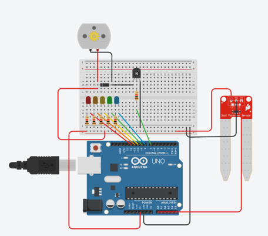

# Automata öntözőrendszer

**Tinkercad és Arduino alapú beadandó dokumentáció**

Arduino Uno • talajnedvesség szenzor • LED kijelzés • motoros locsoló



*1. ábra: A Tinkercad-ben elkészített kapcsolás részlete*

| Adat | Leírás |
|---|---|
| Készítette | Kulcsár Dániel - M3BHZP |
| Téma | Automata öntözőrendszer szimulációja |
| Környezet | Tinkercad Circuits |
| Vezérlő | Arduino Uno R3 |
| Fő funkció | Talajnedvesség mérése és locsoló vezérlése |

---

## 1. A projekt célja

A beadandó célja egy egyszerű, de jól bemutatható automata öntözőrendszer elkészítése Tinkercad környezetben. A rendszer egy Arduino Uno vezérlőre épül, amely egy talajnedvesség szenzor jelét olvassa be, majd a mért érték alapján LED-ekkel jelzi a talaj állapotát, illetve száraz talaj esetén bekapcsolja a locsolót jelképező DC motort.

A projekt jól szemlélteti az analóg bemenetek használatát, a digitális kimenetek vezérlését, valamint azt, hogy egy nagyobb áramigényű fogyasztót - például motort vagy szivattyút - nem közvetlenül az Arduino kimenetéről, hanem tranzisztoros kapcsolással célszerű működtetni.

### 1.1. A megoldandó feladat

- A talaj nedvességének folyamatos figyelése analóg szenzorral.
- A nedvességi érték megjelenítése a Serial Monitorban.
- A talaj állapotának jelzése 5 darab LED segítségével.
- Száraz talaj esetén a locsoló/szivattyú automatikus bekapcsolása.
- Megfelelő nedvesség esetén a locsolás automatikus leállítása.

### 1.2. Miért hasznos ez a rendszer?

Egy automata öntözőrendszer a valóságban képes csökkenteni a felesleges vízhasználatot, mert csak akkor működik, amikor a talaj ténylegesen száraz. A Tinkercad szimuláció ugyan egyszerűsített modell, de jól bemutatja a vezérlési logikát és az érzékelőalapú döntéshozást.

---

## 2. Felhasznált alkatrészek

A kapcsolás az alábbi fő alkatrészekből áll. A Tinkercad-ben a vízpumpát DC motor helyettesíti, mert a szimulációban ez egyszerűen kezelhető és jól látható kimeneti eszköz.

| Alkatrész | Feladat a rendszerben |
|---|---|
| Arduino Uno R3 | A rendszer központi vezérlője. Beolvassa a szenzort és vezérli a kimeneteket. |
| Talajnedvesség szenzor | Analóg jelet ad a talaj nedvességének megfelelően. |
| 5 darab LED | A nedvességi szint vizuális kijelzésére szolgál. |
| 220 Ω ellenállások | A LED-ek áramának korlátozására kellenek. |
| NPN tranzisztor | A motor/szivattyú kapcsolását végzi az Arduino jele alapján. |
| 1 kΩ ellenállás | Az Arduino D7 kimenetét védi a tranzisztor Base lábánál. |
| DC motor | A locsolót vagy vízpumpát jelképezi a szimulációban. |
| Dióda | A motor kikapcsolásakor keletkező visszafeszültség ellen véd. |
| Breadboard és vezetékek | Az alkatrészek összekötésére szolgálnak. |

### 2.1. A LED-ek szerepe

Az 5 LED nem kötelező eleme egy automata öntözőrendszernek, de beadandó szempontból nagyon látványos, mert azonnal megmutatja, milyen nedvességi tartományban van a szenzor értéke.

| LED | Jelentés |
|---|---|
| Piros LED | Nagyon száraz talaj, locsoló bekapcsol. |
| Narancs LED | Száraz talaj, locsoló bekapcsol. |
| Sárga LED | Közepes nedvesség, locsoló kikapcsol. |
| Zöld LED | Nedves talaj, locsoló kikapcsol. |
| Kék LED | Nagyon nedves talaj, locsoló kikapcsol. |

---

## 3. Kapcsolási rajz és bekötés

A rendszer három fő részre bontható: a talajnedvesség szenzorra, a LED-es kijelzésre és a motoros locsoló vezérlésére. A szenzor analóg bemenetre csatlakozik, a LED-ek és a motor vezérlése pedig digitális kimenetekkel történik.

### 3.1. Talajnedvesség szenzor bekötése

| Szenzor láb | Arduino csatlakozás |
|---|---|
| VCC | Arduino 5V |
| GND | Arduino GND |
| SIG | Arduino A0 |

A szimulációban a nedvesség értéke úgy változtatható, hogy futás közben rá kell kattintani a Soil Moisture Sensor elemre, majd a megjelenő csúszkával állítani kell a nedvességet.

### 3.2. LED-ek bekötése

| Kimenet | Arduino pin |
|---|---|
| Kék LED | D8 |
| Zöld LED | D9 |
| Sárga LED | D10 |
| Narancs LED | D11 |
| Piros LED | D12 |

Minden LED körébe külön 220 Ω ellenállást célszerű tenni. Az ellenállás lehet a LED előtt vagy után is, a lényeg, hogy sorosan legyen a LED-del.

### 3.3. Motor / locsoló bekötése tranzisztorral

| Pont | Bekötés |
|---|---|
| Arduino D7 | 1 kΩ ellenálláson keresztül a tranzisztor Base lábára |
| Tranzisztor Collector | A motor negatív lábára |
| Tranzisztor Emitter | GND-re |
| Motor pozitív lába | 5V-ra vagy külön táp pozitív pontjára |
| Külön táp negatív pontja | Arduino GND-re, közös GND szükséges |

A motor mellé védődiódát lehet tenni. A dióda csíkos vége a motor pozitív oldalára, a másik vége a motor negatív oldalára kerüljön. Ez védi a tranzisztort a motor kikapcsolásakor keletkező feszültséglökéstől.

---

## 4. A program működési elve

A program ciklikusan beolvassa az A0 analóg bemeneten lévő talajnedvesség értékét. Az Arduino analóg bemenete 0 és 1023 közötti számot ad vissza. Ezt az értéket a program összehasonlítja több határértékkel, majd ennek alapján kapcsolja a LED-eket és a locsolót.

### 4.1. Nedvességi tartományok

| Szenzorérték | Állapot | LED | Locsoló |
|---|---|---|---|
| 0 - 199 | Nagyon száraz | Piros LED | Bekapcsol |
| 200 - 399 | Száraz | Narancs LED | Bekapcsol |
| 400 - 599 | Közepes | Sárga LED | Kikapcsol |
| 600 - 799 | Nedves | Zöld LED | Kikapcsol |
| 800 - 1023 | Nagyon nedves | Kék LED | Kikapcsol |

### 4.2. A döntési logika

A program először kikapcsol minden LED-et és a locsolót. Ezután egy if-else szerkezettel eldönti, hogy melyik tartományba esik a mért nedvességi érték. Mindig csak egy LED világít, így a rendszer állapota egyértelműen leolvasható.

Száraz állapotban a `pumpPin` nevű digitális kimenet HIGH értéket kap. Ez a kimenet vezérli a tranzisztor Base lábát, így a motor áramköre záródik és a locsoló elindul. Nedves állapotban a `pumpPin` LOW értéken marad, ezért a motor nem kap áramot.

### 4.3. Serial Monitor használata

A Serial Monitor fontos ellenőrzési eszköz. Segítségével látható, milyen értéket mér a szenzor, valamint az is, hogy a program szerint éppen melyik állapot aktív. Ez különösen hibakeresésnél hasznos.

---

## 5. Teljes Arduino programkód

Az alábbi kód a végleges Tinkercad kapcsoláshoz készült. A szenzor SIG kimenete az A0 analóg bemenetre van kötve, a motor/szivattyú vezérlőjele pedig a D7 digitális kimeneten jelenik meg.

```cpp
// Automata ontozorendszer Tinkercad-ben

int moisture = 0;

const int moisturePin = A0;
const int pumpPin = 7;

const int blueLed = 8;     // nagyon nedves
const int greenLed = 9;    // nedves
const int yellowLed = 10;  // kozepes
const int orangeLed = 11;  // szaraz
const int redLed = 12;     // nagyon szaraz

void setup() {
  Serial.begin(9600);

  pinMode(blueLed, OUTPUT);
  pinMode(greenLed, OUTPUT);
  pinMode(yellowLed, OUTPUT);
  pinMode(orangeLed, OUTPUT);
  pinMode(redLed, OUTPUT);
  pinMode(pumpPin, OUTPUT);
}

void loop() {
  moisture = analogRead(moisturePin);

  Serial.print("Talajnedvesseg: ");
  Serial.println(moisture);

  digitalWrite(blueLed, LOW);
  digitalWrite(greenLed, LOW);
  digitalWrite(yellowLed, LOW);
  digitalWrite(orangeLed, LOW);
  digitalWrite(redLed, LOW);
  digitalWrite(pumpPin, LOW);

  if (moisture < 200) {
    digitalWrite(redLed, HIGH);
    digitalWrite(pumpPin, HIGH);
    Serial.println("Nagyon szaraz - locsolo BE");
  }
  else if (moisture < 400) {
    digitalWrite(orangeLed, HIGH);
    digitalWrite(pumpPin, HIGH);
    Serial.println("Szaraz - locsolo BE");
  }
  else if (moisture < 600) {
    digitalWrite(yellowLed, HIGH);
    Serial.println("Kozepes nedvesseg - locsolo KI");
  }
  else if (moisture < 800) {
    digitalWrite(greenLed, HIGH);
    Serial.println("Nedves - locsolo KI");
  }
  else {
    digitalWrite(blueLed, HIGH);
    Serial.println("Nagyon nedves - locsolo KI");
  }

  delay(500);
}
```

---

## 6. A kód részletes magyarázata

### 6.1. Változók és pinek megadása

A program elején a használt pinek állandóként vannak megadva. Ez átláthatóbbá teszi a programot, mert később nem kell megjegyezni, hogy melyik szám milyen alkatrészt jelent.

```cpp
const int moisturePin = A0;
const int pumpPin = 7;
const int redLed = 12;
```

### 6.2. `setup()` függvény

A `setup()` csak egyszer fut le, amikor a szimuláció elindul. Itt indul el a soros kommunikáció, és itt állítjuk be a LED-eket, valamint a motor vezérlő pinjét kimenetként.

```cpp
void setup() {
  Serial.begin(9600);
  pinMode(redLed, OUTPUT);
  pinMode(pumpPin, OUTPUT);
}
```

### 6.3. `loop()` függvény

A `loop()` folyamatosan ismétlődik. Minden körben beolvassa a szenzor értékét, kiírja a Serial Monitorra, majd meghozza a döntést arról, hogy melyik LED világítson és induljon-e a locsolás.

```cpp
moisture = analogRead(moisturePin);
Serial.println(moisture);
```

### 6.4. Miért kell először kikapcsolni mindent?

Minden ciklus elején a program LOW állapotba teszi a LED-eket és a motor vezérlését. Így elkerülhető, hogy korábbi állapotból véletlenül bekapcsolva maradjon egy LED vagy a locsoló.

---

## 7. Tesztelés és kalibrálás Tinkercad-ben

A tesztelés célja annak ellenőrzése, hogy a szenzorérték változtatására a rendszer helyesen reagál-e. Tinkercad-ben a Soil Moisture Sensor elemre kattintva megjelenik egy csúszka, amellyel szimulálható a talaj nedvességének változása.

### 7.1. Tesztelési lépések

1. A szimuláció elindítása a Start Simulation gombbal.
2. A Serial Monitor megnyitása.
3. A Soil Moisture Sensor elemre kattintás.
4. A nedvességi csúszka lassú mozgatása alacsony értéktől magas értékig.
5. Annak ellenőrzése, hogy a LED-ek sorrendben váltanak-e.
6. Annak ellenőrzése, hogy piros és narancs állapotban a locsoló/motor bekapcsol-e.
7. Annak ellenőrzése, hogy sárga, zöld és kék állapotban a locsoló kikapcsolva marad-e.

### 7.2. Elvárt eredmények

| Tesztállapot | Elvárt működés |
|---|---|
| Nagyon száraz érték | Piros LED világít, motor indul |
| Száraz érték | Narancs LED világít, motor indul |
| Közepes érték | Sárga LED világít, motor nem forog |
| Nedves érték | Zöld LED világít, motor nem forog |
| Nagyon nedves érték | Kék LED világít, motor nem forog |

### 7.3. Kalibrálás

A programban megadott határértékek egyszerűen módosíthatók. Ha a szimulációban vagy valós eszköznél a szenzor fordítva működne, akkor a határértékeket vagy a feltételeket kell módosítani. Beadandónál fontos, hogy a választott értékekhez tartozó működés következetes legyen.

---

## 8. Hibakeresés és gyakori problémák

A fejlesztés során több tipikus hiba előfordulhat. Ezek nagy része nem programozási, hanem bekötési vagy szimulációs beállítási probléma.

| Hiba | Lehetséges megoldás |
|---|---|
| A szenzor mindig 0-t mutat | Ellenőrizni kell, hogy a SIG ténylegesen A0-ra megy-e, illetve futás közben a szenzor csúszkája állítható-e. |
| SIG kihúzva is változik az érték | Lebegő analóg bemenetet olvas a program. A szenzor jelét fixen az olvasott analóg pinre kell kötni. |
| Csak a piros LED világít | Lehet, hogy a nedvességi csúszka száraz állásban van, vagy a határértékek túl alacsonyak/magasak. |
| A motor nem forog | Külön motor tesztkóddal ellenőrizni kell a D7-tranzisztor-motor bekötést. |
| Túláram hiba jelenik meg | A motor nem mehet közvetlenül Arduino pinről; tranzisztor és ellenállás szükséges. |
| A motor fordítva vagy nem stabilan működik | Ellenőrizni kell a közös GND-t, a tranzisztor C-B-E lábait és a dióda irányát. |

### 8.1. Motor külön tesztkódja

Ha a LED-ek és a szenzor jól működnek, de a motor nem indul, akkor érdemes a motort önállóan tesztelni. Az alábbi kód két másodpercenként be- és kikapcsolja a D7 kimenetet.

```cpp
const int pumpPin = 7;

void setup() {
  pinMode(pumpPin, OUTPUT);
}

void loop() {
  digitalWrite(pumpPin, HIGH);
  delay(2000);

  digitalWrite(pumpPin, LOW);
  delay(2000);
}
```

---

## 9. Összegzés

A beadandóban elkészült egy Tinkercad-ben szimulált automata öntözőrendszer. A rendszer Arduino Uno vezérlőt használ, amely egy talajnedvesség szenzorból érkező analóg jelet dolgoz fel. A mért érték alapján a program LED-ekkel jelzi a nedvességi állapotot, valamint száraz talaj esetén bekapcsolja a locsolót jelképező DC motort.

A projekt bemutatja az érzékelőalapú vezérlés alapjait, az analóg bemenet használatát, a digitális kimenetek kezelését, valamint a motor tranzisztoros vezérlésének szükségességét. A rendszer továbbfejleszthető például LCD kijelzővel, kézi indító gombbal, relémodullal, valós vízpumpával vagy állítható nedvességi határértékkel.

### 9.1. Beadandóhoz használható rövid bemutató szöveg

A projekt egy automata öntözőrendszert valósít meg Arduino Uno segítségével. A talajnedvesség szenzor az A0 analóg bemenetre csatlakozik, ahol az Arduino 0 és 1023 közötti értéket olvas be. A program a mért érték alapján LED-ekkel jelzi a talaj nedvességi állapotát. Ha a talaj száraz, a vezérlő bekapcsolja a locsolót jelképező DC motort, nedves talaj esetén pedig kikapcsolva tartja azt. A motor tranzisztoros kapcsoláson keresztül vezérelhető, mert az Arduino kimenete közvetlenül nem alkalmas nagyobb áramú fogyasztó meghajtására.

### 9.2. Ellenőrzőlista leadás előtt

- A szenzor VCC lába 5V-ra, GND lába GND-re, SIG lába A0-ra van kötve.
- A kódban a `moisturePin` értéke A0.
- A LED-ek a megfelelő digitális pinekre vannak kötve.
- A motor D7 kimenetről, tranzisztoron keresztül kap vezérlést.
- A Serial Monitorban látható a talajnedvesség értéke.
- A Tinkercad szenzor csúszkájának mozgatására változnak a LED-ek.
- Száraz értéknél a locsoló bekapcsol, nedves értéknél kikapcsol.
